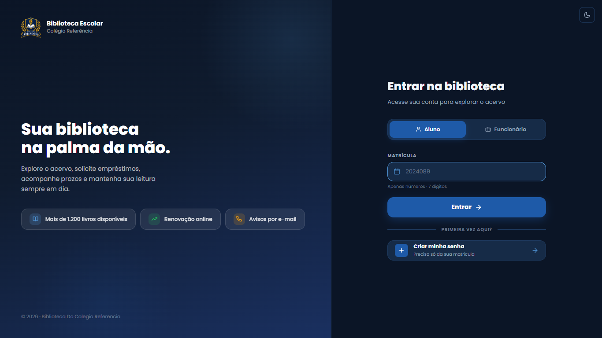
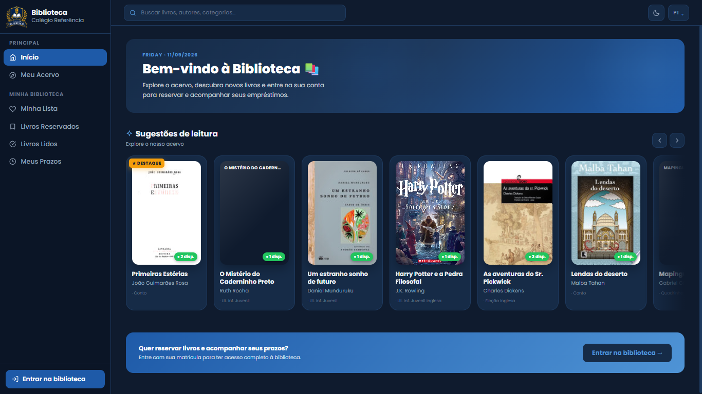
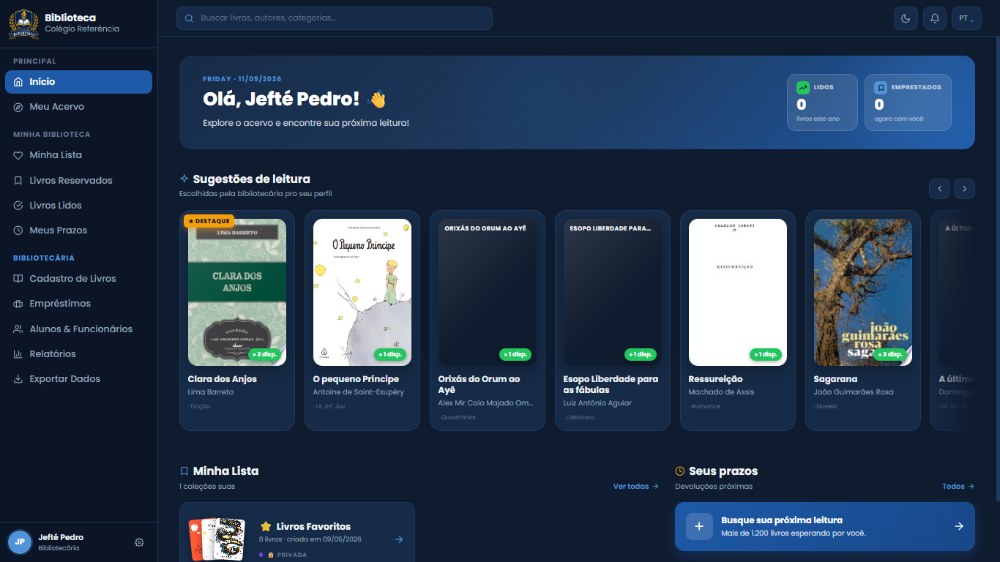
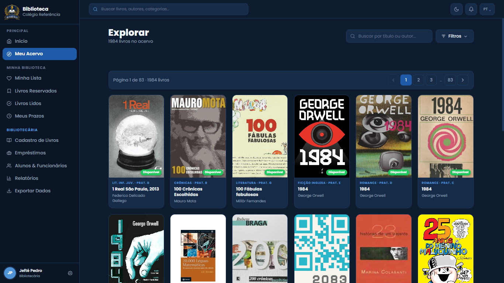
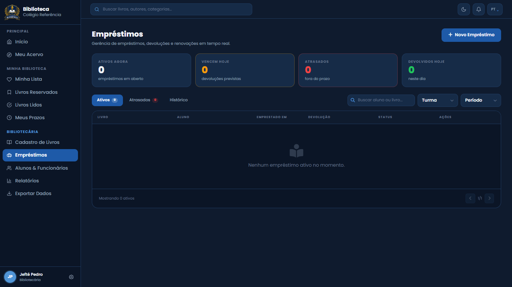

# 📚 Web School Library

Sistema completo de gerenciamento de biblioteca escolar desenvolvido como projeto full stack, unindo interface moderna, API robusta e banco de dados relacional.

> **Nota sobre esta versão:** este repositório é uma versão de portfólio, adaptada a partir de um sistema desenvolvido originalmente para uma instituição de ensino real. Nomes, identidade visual e dados de usuários foram substituídos por versões fictícias antes da publicação.

---

## 📋 Sobre o Projeto

O **Web School Library** é uma aplicação web desenvolvida para simular o funcionamento de um sistema real de biblioteca escolar. O projeto foi construído com foco em segurança, organização de código e experiência do usuário, aplicando conhecimentos de desenvolvimento full stack com tecnologias modernas.

A aplicação oferece funcionalidades como gerenciamento de livros e alunos, controle de empréstimos, devoluções e reservas, autenticação segura de usuários e sistema de notificações automáticas.

O projeto está **em fase de desenvolvimento contínuo** e ainda não foi colocado em produção.

---

## 🖼️ Screenshots

| Login | Home (visitante) |
|---|---|
|  |  |

| Home (usuário logado) | Catálogo de livros |
|---|---|
|  |  |

| Painel de empréstimos (bibliotecária) |
|---|
|  |

---

## 🚀 Funcionalidades

- ✅ Login e cadastro de usuários
- ✅ Recuperação de senha
- ✅ Verificação de e-mail
- ✅ Criptografia de senhas (via Django Auth)
- ✅ Catálogo de livros com busca e filtros
- ✅ Cadastro de livros e alunos
- ✅ Registro e controle de empréstimos
- ✅ Prazo automático de devolução (15 dias)
- ✅ Renovação de empréstimos
- ✅ Sistema de reservas, com expiração automática e fila de espera
- ✅ Verificação de disponibilidade dos livros
- ✅ Controle de permissões e níveis de acesso (aluno, ex-aluno, funcionário, administrador)
- ✅ Sistema de notificações automáticas (no sininho e por e-mail)
- ✅ Testes automatizados cobrindo regras de negócio centrais
- 🔜 Integração com WhatsApp (tentada e descontinuada — ver seção de decisões técnicas abaixo)

---

## 🛠️ Tecnologias Utilizadas

| Camada | Tecnologia |
|---|---|
| Front-end | HTML5, CSS3, JavaScript |
| Back-end | Python, Django, Django REST Framework |
| Banco de Dados | MySQL |
| Autenticação | Django Auth (sessões, permissões, hash de senha) |
| Agendamento de tarefas | APScheduler |

---

## 🗂️ Estrutura do Projeto

```
web-school-library/
├── Backend/
│   └── projeto/
│       ├── biblioteca/      # App principal (models, views, API, notificações, reservas)
│       ├── projeto/         # Configurações do Django
│       ├── manage.py
│       └── requirements.txt
├── docs/
│   └── screenshots/         # Imagens usadas neste README
└── README.md
```

---

## 🏗️ Arquitetura

O projeto usa Django com renderização tradicional (SSR) no front-end, com uma API REST (Django REST Framework) disponível em paralelo para os recursos que precisam de acesso programático.

O sistema de notificações e reservas roda de forma independente da aplicação web, através do **APScheduler**, que executa automaticamente duas vezes ao dia (08:00 e 20:00, horário de Recife) e centraliza duas responsabilidades:

- verificação de prazos de devolução (2 dias antes, véspera, no dia e em atraso)
- expiração de reservas vencidas, liberação do exemplar e notificação do próximo da fila

A lógica de negócio permanece isolada nos módulos correspondentes (`notifications.py`, `reservas.py`); o scheduler só orquestra a execução. Os mesmos comandos também podem ser executados manualmente via `manage.py`, o que facilita testes e depuração.

---

## 🔒 Autenticação e Segurança

O sistema diferencia quatro perfis de acesso:

- **Aluno** — acesso ao catálogo e aos próprios empréstimos/reservas
- **Ex-aluno** — acesso limitado
- **Funcionário** — gerenciamento de empréstimos
- **Administrador** — acesso completo ao sistema

Toda a autenticação usa o Django Auth padrão — senhas nunca são armazenadas em texto puro, sempre via hash (`set_password` / `check_password`). Antes da publicação deste repositório, foi feita uma auditoria de segurança que removeu chaves de API expostas em commits anteriores (revogadas junto ao provedor) e reescreveu o histórico do Git para eliminar esse conteúdo por completo.

---

## 🧭 Decisões técnicas e integrações abandonadas

Nem toda tentativa de automação deu certo — e isso faz parte do processo. Documentar essas decisões aqui é mais útil do que escondê-las:

**Google Books API** — usada inicialmente para preencher capas e sinopses automaticamente. Apresentou instabilidade recorrente e foi abandonada; o preenchimento desses dados hoje é manual.

**Integração com WhatsApp (Evolution API)** — a ideia era enviar notificações de prazo diretamente pelo WhatsApp. A integração exigia um número institucional dedicado, que não estava disponível, e usar um número pessoal não era uma opção adequada. A comunicação foi consolidada por e-mail, que atende bem à necessidade.

**SerpApi** — segunda tentativa de automatizar sinopses. O script de teste nunca funcionou de forma confiável; o código foi removido e a chave de API exposta durante os testes foi revogada e reportada ao suporte do provedor.

---

## ✅ Testes Automatizados

O projeto conta com testes automatizados cobrindo as regras de negócio centrais:

- normalização de categoria ao salvar um livro
- disponibilidade de um livro conforme seus exemplares
- cálculo do prazo automático de devolução (15 dias)
- verificação de atraso de empréstimo antes, no dia e depois do vencimento
- empréstimos devolvidos não são contabilizados como atrasados

```
python manage.py test biblioteca

Ran 7 tests
OK
```

---

## 👥 Equipe e Responsabilidades

| Integrante | Área |
|---|---|
| **Jefté Pedro** | Front-end, Back-end (API) & Documentação |
| **Alesson Passos** | Banco de Dados |
| **Luiz Alexandre** | Back-end (API) & Documentação |
| **João Erick** | Back-end (API) |
| **Lázaro Antonio** | Back-end (API) & Documentação |
| **Daniel Santos** | Autenticação |
| **Matheus da Silva** | Notificações & Documentação |

Projeto acadêmico desenvolvido em equipe. Este repositório reflete principalmente a participação de Jefté Pedro na integração e evolução do sistema — front-end, back-end, regras de negócio, autenticação, permissões, integração banco/API e refatorações — construída sobre a base inicial estabelecida pelo restante da equipe.

---

## 📄 Licença

Este é um projeto de portfólio pessoal, adaptado a partir de um sistema desenvolvido originalmente para uma instituição de ensino real (nomes e identidade visual foram substituídos por versões fictícias nesta versão pública).

Todos os direitos reservados. O código-fonte, a estrutura e os recursos deste sistema não são de uso livre. É proibido copiar, redistribuir, modificar ou utilizar qualquer parte deste projeto sem autorização prévia e expressa do autor.

Para dúvidas, parcerias ou autorizações, entre em contato com o autor.